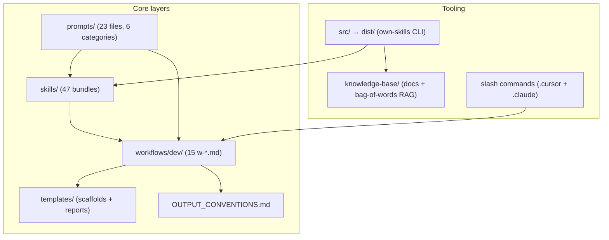

# Comprehensive Repo Review -- own-skills

> **Date:** 2026-04-03  **Scope:** Full repo  **Type:** Report only (no implementation)

---

## 1. Architecture overview

**What this repo is:** A Markdown-first "expert-in-a-box" system — 47 skill bundles, 15 dev workflows, a prompt library, output formatting conventions, and a lightweight Node CLI for install/RAG/validation. It ships into other projects via `npx github:truongnat/skills` (degit/git clone into `vendor/own-skills/`).

**What it is NOT:** It is not a runtime engine that executes workflows automatically. It is a reference corpus that agents (Cursor, Claude Code, Codex) read and follow.

---

## 2. Strengths

- **Structural consistency.** All 47 skills pass `validate-skills`. The canonical `SKILL.md` skeleton (frontmatter, When to use, Workflow 3 steps, Operating principles, topic summaries, Suggested response format, Resources table, Quick example, Checklist) is followed uniformly.
- **Authoring rules are rigorous.** `SKILL_AUTHORING_RULES.md` defines 12 sections (including the recently added quality rubric, prompt guidance, and update-vs-new decision tree) with clear mandatory/optional markers and a mandatory documentation update matrix (section 8).
- **Output visual contract.** `OUTPUT_CONVENTIONS.md` + 5 report templates give agents a concrete target for severity emojis, callouts, and structure. All 15 workflows reference it.
- **Workflow enhanced contracts.** Every `w-*.md` now includes Decision paths, Error handling, Output format, Time estimate, and Escalation -- a big upgrade from the original "steps only" state.
- **Prompt JTBD tree.** `prompts/` is organized into 6 functional categories with 23 files. This is a significant improvement over the single legacy template.
- **Self-validation tooling.** `validate-skills`, `analyze-skills --self-review`, `build-skill-index`, `build-kb`, `verify-kb` provide a CI-capable integrity pipeline.
- **Good cross-referencing.** Skills reference sibling skills via "Related skills" tables and `references/integration-map.md`. Workflows link to prompt companions and report templates.

---

## 3. Repo direction and approach assessment

### 3.1 Direction

The repo aims to be a **portable knowledge layer** that makes any AI agent immediately "senior" in common dev workflows. The approach — Markdown as the interface, no runtime dependency beyond Node for install — is pragmatic: it works across Cursor, Claude Code, and Codex without vendor coupling.

### 3.2 Approach critique

| Aspect                           | Assessment                                                                                                                                                                                                                                                                           |
| -------------------------------- | ------------------------------------------------------------------------------------------------------------------------------------------------------------------------------------------------------------------------------------------------------------------------------------ |
| **Markdown-only knowledge**      | Correct call for portability. Risk: no automated enforcement that agents actually follow the format. Mitigation: checklists + `validate-skills` partially cover this.                                                                                                                |
| **Bag-of-words RAG**             | The `embeddings.ts` is a hash-based bag-of-tokens vector (256 dims, FNV-1a hash). This is better than nothing but significantly weaker than even a small transformer embedding. Semantic queries like "how do I handle auth in Next.js" will miss relevant docs phrased differently. |
| **47 skills with varying depth** | Breadth is impressive. The depth gap between priority skills (8-10 refs) and thin skills (2 refs) creates an inconsistent experience.                                                                                                                                                |
| **Monolith vs modular tension**  | `PROMPT_TEMPLATES.md` (800+ lines) still exists alongside the new `prompts/` tree. The dual source creates discovery confusion.                                                                                                                                                      |

---

## 4. Gap report

### 4.1 Skill depth gaps

**Tier system vs reality:**

The IMPROVEMENT_PLAN defines 3 tiers. Current state:

| Tier                                                                                              | Expected refs                                                                                | Skills meeting bar                                                         | Skills below bar                                                                |
| ------------------------------------------------------------------------------------------------- | -------------------------------------------------------------------------------------------- | -------------------------------------------------------------------------- | ------------------------------------------------------------------------------- |
| **Core** (react, nextjs, security, testing, typescript, nestjs, postgresql)                       | 6+ files: tips, edge-cases, decision-tree, versions, integration-map, anti-patterns + domain | **All 7 meet bar** (8-10 refs each)                                        | None                                                                            |
| **Mid** (docker, ci-cd, auth, caching, deployment, code-packaging, network-infra, ai-integration) | 4+ files: tips, edge-cases, decision-tree, anti-patterns                                     | docker (7), ci-cd (8), auth (7), caching (7), ai-integration (10) meet bar | **deployment** (4), **code-packaging** (4), **network-infra** (5) -- borderline |
| **Support** (planning, feedback, git-ops, bug-discovery, algorithm)                               | 2+ files: tips, edge-cases                                                                   | All have 4-7 refs                                                          | None                                                                            |

**Thin skills (only 2 reference files -- `tips-and-tricks.md` + `edge-cases.md`):**

- `clean-code-architecture-pro` -- **no** decision-tree, anti-patterns, or integration-map despite being referenced by `w-refactor.md` as the primary skill
- `performance-tuning-pro` -- **no** decision-tree despite being the primary skill for `w-perf-investigation.md`
- `microservices-pro` -- thin for a complex domain
- `graphql-pro` -- thin; no schema design or federation guidance
- `websocket-pro` -- thin
- `stream-rtc-pro` -- thin
- `javascript-pro` -- thin; could arguably merge into `typescript-pro` or stay as runtime-behavior reference

**Missing `Related skills` table in SKILL.md:**

- `react-pro` -- has integration-map in references/ but no `## Related skills` section in SKILL.md
- `nextjs-pro` -- same situation

### 4.2 Workflow gaps

**Workflows without a `templates/report/` artifact link (6 of 15):**

- `w-ticket.md` -- uses Kanban structure, arguably OK
- `w-test-strategy.md` -- **gap**: could use a test-strategy report template
- `w-onboarding.md` -- uses doc artifacts, arguably OK
- `w-hotfix.md` -- **gap**: could reference a lightweight fix report
- `w-dep-audit.md` -- **gap**: no dependency audit report template exists
- `w-debug.md` -- links to prompts/debugging/ but not to a debug report template

**Missing slash commands in `.claude/commands/`:**

The `.cursor/commands/` folder has **15** command files (matching all workflows). But `.claude/commands/` has only **4** (route, optimize, find-skill, run-workflow) -- **no** workflow-specific `/w-*` commands for Claude Code. This means Claude Code users cannot invoke `/w-code-review`, `/w-debug`, etc. directly.

**Missing from `workflows/dev/README.md` index:**

The dev README currently lists 10 workflows. But the folder contains **15** `w-*.md` files. The following are **present as files** but **missing from the README table**: `w-api-design`, `w-data-migration`, `w-dep-audit`, `w-onboarding`, `w-test-strategy`.

**Missing from root `README.md` workflows table:**

Same 5 workflows missing from the root README table.

**Missing from `AGENTS.md` slash command table:**

Same 5 workflows not listed in the AGENTS.md command table despite having `.cursor/commands/` files.

### 4.3 Prompt gaps

**Few-shot examples:** Only `feature-planning.md` has a `## Few-shot examples` section. The plan's section 4.2 requires every prompt to include this. **22 of 23 prompts are missing few-shot examples.**

`**## Chain: next step`:** Present in 9 of 22 single-step prompts. Missing in 13: `risk-assessment`, `sprint-breakdown`, `api-review-request`, `performance-review-request`, `test-generation`, `documentation-generation`, `migration-script`, `dependency-audit`, `skill-gap-analysis`, plus chains themselves.

**Missing prompts from IMPROVEMENT_PLAN section 4.3 (10 priority prompts):**

All 10 priority prompts are implemented. However, the plan's directory tree (section 4.1) also shows `performance-profiling.md` under `debugging/` -- which exists. Coverage is good.

### 4.4 Template gaps

`**PROMPT_TEMPLATES.md` monolith:** Still 800+ lines. The new `prompts/` tree is the canonical source, but the monolith is not deprecated or trimmed. Agent confusion risk: which to follow?

**Missing report templates implied by workflows:**

- `w-test-strategy.md` -- no `templates/report/test-strategy.md`
- `w-dep-audit.md` -- no `templates/report/dependency-audit.md`
- `w-onboarding.md` -- no onboarding checklist template
- `w-debug.md` -- no `templates/report/debug-report.md` (relies on prompts/ instead)

### 4.5 Knowledge base gaps

- **INDEX.md is stale:** Only **7** document entries. The recent IMPROVEMENT_PLAN implementation added many new files under `templates/`, `prompts/`, and `workflows/` but **did not add KB documents** for them. The INDEX itself has not been expanded.
- **No project overview doc:** The `PROJECT_GAP_ANALYSIS.md` (2026-03-31) itself recommended creating `knowledge-base/documents/repo/project-overview.md`. This still does not exist.
- **RAG quality:** The bag-of-words embedding (`embeddings.ts`) has no semantic understanding. Queries like "how to handle authentication in a Next.js app" will score poorly against docs that use different wording. This is a **structural ceiling** on `query-kb` usefulness.
- **No CI integration:** `validate-skills` and `build-kb` are manual commands. No GitHub Actions or pre-commit hooks enforce consistency.

### 4.6 Tooling and infrastructure gaps

- **No tests for CLI tools.** `src/` has no test files. `tools.ts` and `own-skills.ts` are untested.
- **No `.github/workflows/`** directory. No CI/CD at all.
- `**requirements.txt` at root** is marked "Legacy" in README but still exists. Potential confusion.
- `**scripts/` folder** contains only shell wrappers that delegate to `node dist/tools.js`. The indirection adds no value; could be documented aliases instead.
- `**dist/` is committed.** The compiled output is in the repo (for `npx` to work without a build step). This means every TypeScript change requires a manual `npm run build` and commit of `dist/`. No pre-commit hook or CI enforces this.

### 4.7 Documentation consistency gaps

- `**skills-layout.md`** tree listing does not include recently added reference files (decision-tree, anti-patterns, versions, integration-map across 5 priority skills). It lists folder names only, not files -- so technically correct but less useful for discovery.
- `**IMPROVEMENT_PLAN.md`** does not have a "what is done" status tracker. The roadmap (Phase 1-6) lists items but does not mark completion. An agent picking this up cannot tell what was already implemented.

---

## 5. Risk assessment

| Risk                                                                                               | Severity | Notes                                                                |
| -------------------------------------------------------------------------------------------------- | -------- | -------------------------------------------------------------------- |
| **Index drift** -- README, AGENTS, dev/README, IMPROVEMENT_PLAN fall out of sync with actual files | High     | Already happening: 5 workflows exist but are not in the index tables |
| **Monolith confusion** -- PROMPT_TEMPLATES.md vs prompts/                                          | Medium   | Agents may read the wrong source                                     |
| **Shallow skills** -- 7 skills at only 2 reference files                                           | Medium   | Agents using those skills get thin guidance                          |
| **No CI** -- validation is manual only                                                             | Medium   | Broken skills or stale KB can ship unnoticed                         |
| **RAG ceiling** -- bag-of-words cannot do semantic search                                          | Low-Med  | Limits `query-kb` utility for complex queries                        |
| **dist/ drift** -- compiled JS can diverge from src/                                               | Medium   | No automated check                                                   |

---

## 6. Strategic recommendations (prioritized)

1. **Fix index drift now.** Add the 5 missing workflows to `workflows/dev/README.md`, root `README.md`, and `AGENTS.md`. This is a 15-minute fix with outsized discovery impact.
2. **Add CI.** A single GitHub Actions workflow running `npm run build && node dist/tools.js validate-skills && node dist/tools.js verify-kb` on push/PR would catch 80% of drift issues.
3. **Deepen the 7 thin skills.** At minimum add `decision-tree.md` and `anti-patterns.md` to `clean-code-architecture-pro`, `performance-tuning-pro`, and `microservices-pro` -- these are actively referenced by workflows.
4. **Add Claude Code workflow commands.** The 15 `.cursor/commands/w-*.md` files should be mirrored (or symlinked) to `.claude/commands/` for parity.
5. **Deprecate PROMPT_TEMPLATES.md properly.** Add a clear "DEPRECATED -- use `prompts/`" banner at the top, or reduce it to a redirect file.
6. **Mark IMPROVEMENT_PLAN completion status.** Add checkboxes or a status column to the roadmap so the next agent knows what Phase 1-5 items are done.
7. **Consider upgrading RAG.** Even a small local model (e.g. `@xenova/transformers` with `all-MiniLM-L6-v2`) would dramatically improve `query-kb` quality with minimal dependency cost.
8. **Add missing report templates** for `test-strategy`, `dependency-audit`, and `debug-report` to close the workflow-to-template gap.

---

## 7. Quantitative snapshot

| Metric                                | Count               |
| ------------------------------------- | ------------------- |
| Bundled skills                        | 47                  |
| Skills with 6+ reference files        | 19                  |
| Skills with only 2 reference files    | 7                   |
| Dev workflows                         | 15                  |
| Workflows with full enhanced contract | 15/15               |
| Workflows indexed in README/AGENTS    | 10/15               |
| Prompt files                          | 23                  |
| Prompts with few-shot examples        | 1/23                |
| Report templates                      | 5                   |
| Cursor slash commands                 | 15                  |
| Claude Code slash commands            | 4 (no w-* commands) |
| KB documents indexed                  | 7                   |
| Test files for CLI                    | 0                   |
| CI workflows                          | 0                   |

