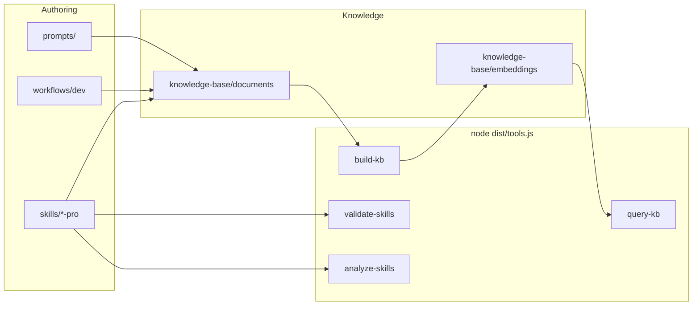

# Skills devkit

**Production-grade agent skills**, runnable **workflows**, and a **Markdown knowledge base** with optional local RAG — one repo you can install into any project or use as the source of truth for Cursor / Claude / Codex skills.

> **Language:** Docs and bundled `SKILL.md` files are authored in **English**. Assistant reply language (e.g. Vietnamese) is configured with **Cursor User Rules** or project rules — see [`AGENTS.md`](AGENTS.md) and [`skills/SKILL_AUTHORING_RULES.md`](skills/SKILL_AUTHORING_RULES.md) §13.

---

## Contents

| Section | What you get |
|--------|----------------|
| [Layout](#layout) | Repository map at a glance |
| [Architecture](#architecture-overview) | How skills, KB, and CLI connect |
| [Quick start](#quick-start) | Install into another repo · work in this repo |
| [Knowledge base & RAG](#knowledge-base--rag) | Author → index → query |
| [Project indexing](#project-indexing-any-codebase) | Index *any* codebase + wiki |
| [Skills](#skills) | Bundled `*-pro` packs and authoring rules |
| [Workflows](#workflows) | Slash-style dev procedures |
| [Prompt templates](#prompt-templates) | Reusable prompts |
| [Cursor / agent](#cursor--agent) | Where to read next |

---

## Layout

```
.
├── skills/                 # Skill packs (SKILL.md + references/)
├── scripts/                # CLI entry: dist/tools.js
├── templates/              # Reports, issues, prompts
├── workflows/              # Runnable Markdown procedures
└── knowledge-base/         # Internal KB + embeddings
```

Abridged tree:

```
.
├── AGENTS.md               # Cursor / agent hints (skills, commands, KB)
├── OUTPUT_CONVENTIONS.md   # Workflow report shape
├── LICENSE                 # MIT
├── package.json            # npx CLI + npm scripts
├── skills/
│   ├── README.md
│   ├── SKILL_AUTHORING_RULES.md
│   └── <skill-name>/       # e.g. react-pro, docker-pro, …
├── scripts/README.md       # Full command map
├── workflows/
│   ├── README.md
│   └── dev/                # /ticket, /index-project, …
├── knowledge-base/
│   ├── INDEX.md
│   ├── documents/          # RAG source Markdown
│   └── embeddings/         # rag_*.json, skill_index.json
├── prompts/
├── src/                    # TypeScript source
└── dist/                   # npm run build → JS
```

---

## Architecture overview



---

## Quick start

### Install into another project

Run from the **target project root**:

```bash
npx github:truongnat/skills
```

Update an existing install:

```bash
npx github:truongnat/skills update
```

### Work in this repository

```bash
npm install
npm run build
node dist/tools.js validate-skills
node dist/tools.js build-skill-index
node dist/tools.js build-kb
node dist/tools.js query-kb "your question"
```

Full CLI reference: **[`scripts/README.md`](scripts/README.md)**.

---

## Knowledge base & RAG

1. Add or edit `.md` under [`knowledge-base/documents/`](knowledge-base/documents/).
2. Update [`knowledge-base/INDEX.md`](knowledge-base/INDEX.md).
3. `node dist/tools.js build-kb`
4. `node dist/tools.js query-kb "…"` (or `query-kb-batch` for many queries)

---

## Project indexing (any codebase)

| Step | Command / workflow |
|------|----------------------|
| 1. Index | `node dist/tools.js index-project --dir <project_root> --out <index_dir>` |
| 2. Query | `node dist/tools.js query-kb "question" --index <index_dir>` |
| 3. Wiki | `node dist/tools.js generate-wiki --docs <index_dir>/docs` |
| 4. Guided | Workflow **`/index-project`** — [`workflows/dev/index-project.md`](workflows/dev/index-project.md) |

---

## Skills

Bundled skills follow a **consistent professional shape**: boundary in `SKILL.md`, deep dives under `references/`, and for most `*-pro` packs — **system model**, **failure modes**, **decision trade-offs**, **quality guardrails**, plus a **strict 8-step** suggested response format for agents.

| Doc | Purpose |
|-----|---------|
| [`skills/SKILL_AUTHORING_RULES.md`](skills/SKILL_AUTHORING_RULES.md) | Mandatory rules before adding a skill |
| [`skills/README.md`](skills/README.md) | Catalog of all bundled skills |

Validate and audit from repo root:

```bash
node dist/tools.js validate-skills
node dist/tools.js analyze-skills --self-review
```

---

## Workflows

Conventions (naming, parallel steps): [`workflows/README.md`](workflows/README.md).

| Command | Document | Purpose |
|---------|----------|---------|
| **`/ticket`** | [`workflows/dev/ticket.md`](workflows/dev/ticket.md) | Ticket / Kanban |
| **`/release`** | [`workflows/dev/release.md`](workflows/dev/release.md) | Release notes → work |
| **`/hotfix`** | [`workflows/dev/hotfix.md`](workflows/dev/hotfix.md) | Urgent production fix |
| **`/code-review`** | [`workflows/dev/code-review.md`](workflows/dev/code-review.md) | Structured review |
| **`/debug`** | [`workflows/dev/debug.md`](workflows/dev/debug.md) | Systematic debugging |
| **`/security-audit`** | [`workflows/dev/security-audit.md`](workflows/dev/security-audit.md) | Security review |
| **`/arch-review`** | [`workflows/dev/arch-review.md`](workflows/dev/arch-review.md) | Architecture review |
| **`/perf-investigation`** | [`workflows/dev/perf-investigation.md`](workflows/dev/perf-investigation.md) | Performance |
| **`/refactor`** | [`workflows/dev/refactor.md`](workflows/dev/refactor.md) | Safe refactor |
| **`/incident`** | [`workflows/dev/incident.md`](workflows/dev/incident.md) | Incident response |
| **`/data-migration`** | [`workflows/dev/data-migration.md`](workflows/dev/data-migration.md) | Data / DB migration |
| **`/onboarding`** | [`workflows/dev/onboarding.md`](workflows/dev/onboarding.md) | Onboarding |
| **`/api-design`** | [`workflows/dev/api-design.md`](workflows/dev/api-design.md) | API design |
| **`/test-strategy`** | [`workflows/dev/test-strategy.md`](workflows/dev/test-strategy.md) | Test strategy |
| **`/dep-audit`** | [`workflows/dev/dep-audit.md`](workflows/dev/dep-audit.md) | Dependencies |
| **`/index-project`** | [`workflows/dev/index-project.md`](workflows/dev/index-project.md) | Index any repo |

---

## Prompt templates

See [`templates/README.md`](templates/README.md) and the [`prompts/`](prompts/) directory.

---

## Cursor / agent

[`AGENTS.md`](AGENTS.md) — skills paths, slash commands, KB usage, and how to point Cursor at this bundle.

---

## License

[MIT](LICENSE)
