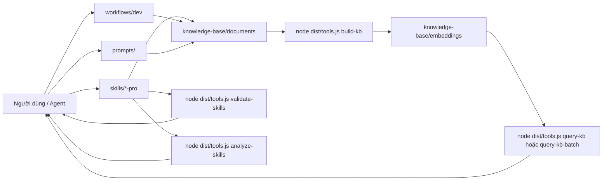

# SKILLS — Kỹ năng, quy trình & cơ sở tri thức (Markdown)

Kho lưu trữ mẫu: **`skills/`** (gói `SKILL.md`), **`workflows/`** (các bước thực hiện Markdown), **`knowledge-base/`** (`.md` + RAG nội bộ). Cấu hình và quy ước quy trình sử dụng **Markdown**, không sử dụng `.yaml`/`.yml` cho các vai trò này (các script có thể xuất JSON cho embeddings).

## Nội dung

- [Cấu trúc thư mục](#cấu-trúc-thư-mục)
- [Bắt đầu nhanh](#bắt-đầu-nhanh)
- [Cơ sở tri thức & RAG](#cơ-sở-tri-thức--rag)
- [Lập chỉ mục dự án (Bất kỳ mã nguồn nào)](#lập-chỉ-mục-dự-án-bất-kỳ-mã-nguồn-nào)
- [Kỹ năng (Skills)](#kỹ-năng-skills)
- [Quy trình (Workflows)](#quy-trình-workflows)
- [Prompt templates](#prompt-templates)
- [Cursor / Agent](#cursor--agent)

## Cấu trúc thư mục

Kiến trúc cơ bản tập trung vào 5 thành phần chính:

```
.
├── skills/                    # Các gói kỹ năng (e.g. react-pro, nestjs-pro, ...)
├── scripts/                   # Các script công cụ (implementation: `dist/tools.js`)
├── templates/                 # Các mẫu báo cáo, issue, prompt
├── workflows/                 # Các quy trình thực hiện (từng bước bằng Markdown)
└── knowledge-base/            # Cơ sở tri thức nội bộ và embeddings
```

Chi tiết đầy đủ:

```
.                              # Gốc repo
├── AGENTS.md                  # Gợi ý cho Cursor/agent (skills, commands, KB)
├── OUTPUT_CONVENTIONS.md      # Quy ước định dạng báo cáo cho workflows
├── LICENSE                    # MIT
├── package.json               # CLI npx và các script npm
├── skills/
│   ├── README.md
│   ├── SKILL_AUTHORING_RULES.md
│   └── <skill-name>/          # ví dụ: react-pro, repo-tooling-pro, …
├── scripts/
│   └── README.md              # Bản đồ câu lệnh
├── templates/
│   ├── README.md
│   └── report/                # ví dụ: project-index-report.md
├── workflows/
│   ├── README.md              # Quy ước, thực thi song song
│   └── dev/                   # /ticket, /index-project, …
├── knowledge-base/
│   ├── INDEX.md
│   ├── documents/             # Nguồn .md cho RAG
│   └── embeddings/            # rag_*.json, skill_index.json
├── prompts/                   # Các gợi ý (planning, review, …)
├── src/                       # Mã nguồn TypeScript
└── dist/                      # JS đã biên dịch (`npm run build`)
```

## Tổng quan kiến trúc



## Bắt đầu nhanh

### Cài đặt vào dự án khác

Chạy từ **thư mục gốc của dự án mục tiêu**.

```bash
# Cài đặt (mặc định)
npx github:truongnat/skills

# Cập nhật bản cài đặt hiện có
npx github:truongnat/skills update
```

### Làm việc trong repo này (Node + TypeScript)

```bash
npm install
npm run build
node dist/tools.js build-kb
node dist/tools.js query-kb "câu hỏi của bạn"
```

Xem [`scripts/README.md`](scripts/README.md) để biết đầy đủ bản đồ câu lệnh.

## Cơ sở tri thức & RAG

1. Chỉnh sửa file `.md` trong [`knowledge-base/documents/`](knowledge-base/documents/).
2. Cập nhật [`knowledge-base/INDEX.md`](knowledge-base/INDEX.md).
3. Chạy `node dist/tools.js build-kb`.
4. Truy vấn: `node dist/tools.js query-kb "..."`.

## Lập chỉ mục dự án (Project Indexing)

Sử dụng khi bạn cần một chỉ mục vector và bản tóm tắt Markdown cho một repository **khác**.

1. **CLI:** `node dist/tools.js index-project --dir <gốc_dự_án> --out <thư_mục_chỉ_mục>`.
2. **Truy vấn:** `node dist/tools.js query-kb "câu hỏi" --index <thư_mục_chỉ_mục>`.
3. **Wiki:** `node dist/tools.js generate-wiki --docs <thư_mục_chỉ_mục>/docs`.
4. **Workflow:** **`/index-project`** ([`workflows/dev/index-project.md`](workflows/dev/index-project.md)).

## Kỹ năng (Skills)

- **Quy tắc:** [`skills/SKILL_AUTHORING_RULES.md`](skills/SKILL_AUTHORING_RULES.md).
- **Danh mục:** Danh sách đầy đủ trong **[`skills/README.md`](skills/README.md)**.

## Quy trình (Workflows)

Quy ước đặt tên và thực thi song song: [`workflows/README.md`](workflows/README.md).

| Lệnh | File | Mục đích |
|-------|------|---------|
| **`/ticket`** | [`workflows/dev/ticket.md`](workflows/dev/ticket.md) | Xử lý Ticket / Kanban |
| **`/release`** | [`workflows/dev/release.md`](workflows/dev/release.md) | Ghi chú phát hành → triển khai |
| **`/hotfix`** | [`workflows/dev/hotfix.md`](workflows/dev/hotfix.md) | Sửa lỗi khẩn cấp |
| **`/code-review`** | [`workflows/dev/code-review.md`](workflows/dev/code-review.md) | Đánh giá mã nguồn có phân cấp mức độ |
| **`/debug`** | [`workflows/dev/debug.md`](workflows/dev/debug.md) | Quy trình gỡ lỗi hệ thống |
| **`/security-audit`** | [`workflows/dev/security-audit.md`](workflows/dev/security-audit.md) | Kiểm tra bảo mật |
| **`/arch-review`** | [`workflows/dev/arch-review.md`](workflows/dev/arch-review.md) | Đánh giá kiến trúc / thiết kế |
| **`/perf-investigation`** | [`workflows/dev/perf-investigation.md`](workflows/dev/perf-investigation.md) | Điều tra hiệu năng |
| **`/refactor`** | [`workflows/dev/refactor.md`](workflows/dev/refactor.md) | Tái cấu trúc an toàn (test-first) |
| **`/incident`** | [`workflows/dev/incident.md`](workflows/dev/incident.md) | Phản ứng sự cố |
| **`/data-migration`** | [`workflows/dev/data-migration.md`](workflows/dev/data-migration.md) | Di cư dữ liệu / DB |
| **`/onboarding`** | [`workflows/dev/onboarding.md`](workflows/dev/onboarding.md) | Hướng dẫn thành viên mới |
| **`/api-design`** | [`workflows/dev/api-design.md`](workflows/dev/api-design.md) | Thiết kế / đánh giá API |
| **`/test-strategy`** | [`workflows/dev/test-strategy.md`](workflows/dev/test-strategy.md) | Chiến lược kiểm thử |
| **`/dep-audit`** | [`workflows/dev/dep-audit.md`](workflows/dev/dep-audit.md) | Kiểm tra phụ thuộc hệ thống |
| **`/index-project`** | [`workflows/dev/index-project.md`](workflows/dev/index-project.md) | Lập chỉ mục cho bất kỳ dự án nào |

## Bản quyền

[MIT](LICENSE)
