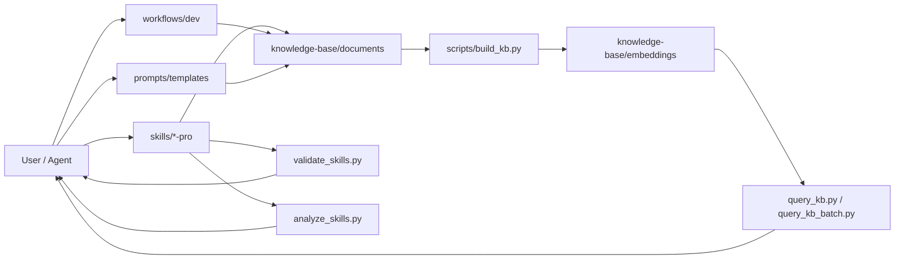

# SKILLS — Skills, workflows & knowledge base (Markdown)

Template repo: **`skills/`** (`SKILL.md` bundles), **`workflows/`** (Markdown steps), **`knowledge-base/`** (`.md` + local RAG). Config and workflow contracts use **Markdown**, not `.yaml`/`.yml` for those roles (scripts may emit JSON for embeddings).

## Contents

- [Directory layout](#directory-layout)
- [Quick start](#quick-start)
- [Knowledge base & RAG](#knowledge-base--rag)
- [Skills](#skills)
- [Workflows](#workflows)
- [Prompt templates](#prompt-templates)
- [Cursor / Agent](#cursor--agent)
- [More docs under `templates/`](#more-docs-under-templates)

## Directory layout

```
skills/                        # repo root (remote install → vendor/own-skills/)
├── config.example.md          # kb-config block for scripts
├── requirements.txt           # Python: numpy, sentence-transformers
├── skills/
│   ├── README.md
│   ├── examples/skill-template/SKILL.md
│   ├── <skill-name>/          # e.g. react-pro, nextjs-pro, …
│   └── …
├── ex/
│   └── ticket/                # Ticket / Kanban skill (outside skills/)
├── workflows/
│   ├── README.md              # Conventions + naming (`w-<slug>.md`)
│   └── dev/                   # /w-ticket, /w-release, /w-hotfix
├── knowledge-base/
│   ├── INDEX.md
│   ├── documents/             # Source .md for RAG
│   └── embeddings/            # rag_*.npy, .json (generated, gitignored)
├── prompts/
│   └── README.md
├── scripts/
│   ├── README.md
│   ├── kb_config_md.py
│   ├── build_kb.py
│   ├── query_kb.py
│   ├── query_kb_batch.py
│   ├── verify_kb.py
│   ├── build_skill_index.py
│   ├── list_skills.py
│   ├── validate_skills.py
│   └── analyze_skills.py
├── .claude/commands/          # Slash commands (e.g. /w-ticket, /route)
└── templates/
```

## Architecture overview



## Quick start

### Install into another project (remote — no clone)

From the **target project root**. Re-running install **updates** the bundle.

```bash
curl -fsSL https://raw.githubusercontent.com/truongnat/skills/main/install-remote.sh | bash
```

```bash
curl -fsSL https://raw.githubusercontent.com/truongnat/skills/main/uninstall-remote.sh | bash
```

Bundle root: `./vendor/own-skills/`. Options: `bash -s -- --help` (`--repo`, `--skills-only`, `--cursor-only`).

**Sanity check** (after a full install, not `--skills-only`):

```bash
python3 vendor/own-skills/scripts/verify_bundle_install.py
```

### Work in this repo (venv, KB, scripts)

```bash
cd <repo-root>                 # e.g. folder `skills` after clone
python3 -m venv .venv && source .venv/Scripts/activate   # Windows: .venv\Scripts\activate
pip install -r requirements.txt
cp config.example.md config.md   # optional
python scripts/build_kb.py
python scripts/query_kb.py "…" -k 5
```

**Python:** 3.10–3.13. First `build_kb` downloads the embedding model (network, RAM). See [`scripts/README.md`](scripts/README.md).

## Knowledge base & RAG

1. Edit `.md` under [`knowledge-base/documents/`](knowledge-base/documents/).
2. Update [`knowledge-base/INDEX.md`](knowledge-base/INDEX.md) when you add a doc.
3. `python scripts/build_kb.py` → `rag_embeddings.npy` + `rag_manifest.json` in `knowledge-base/embeddings/` (gitignored).
4. Query: `python scripts/query_kb.py "…"`; for many queries, `python scripts/query_kb_batch.py` (one model load).
5. `python scripts/verify_kb.py` after builds ([`knowledge-base/VERIFY.md`](knowledge-base/VERIFY.md)).

Model paths live in the `<!-- kb-config-start -->` … `<!-- kb-config-end -->` block in [`config.example.md`](config.example.md) or `config.md`.

**After changing bundled skills** (under `skills/*/`), run `python scripts/build_skill_index.py` so `knowledge-base/embeddings/skill_index.json` stays current (used by `/route`, `/find-skill`, etc.).

## Skills

- **Rules:** [`skills/SKILL_AUTHORING_RULES.md`](skills/SKILL_AUTHORING_RULES.md) — do not add a skill folder until every mandatory item passes; **section 8** lists repo files to update with the same change.
- **Template:** [`skills/examples/skill-template/`](skills/examples/skill-template/) → `skills/<name>/`.
- **Catalog:** full list and descriptions in **[`skills/README.md`](skills/README.md)** (bundled examples table).

## Workflows

Conventions and **`w-<slug>.md`** naming: [`workflows/README.md`](workflows/README.md). Slash commands live in **`.claude/commands/`** and **`.cursor/commands/`**.

| Slash | File | Purpose |
|-------|------|---------|
| **`/w-ticket`** | [`workflows/dev/w-ticket.md`](workflows/dev/w-ticket.md) | Kanban / [`ex/ticket/SKILL.md`](ex/ticket/SKILL.md) |
| **`/w-release`** | [`workflows/dev/w-release.md`](workflows/dev/w-release.md) | Release notes → implementation |
| **`/w-hotfix`** | [`workflows/dev/w-hotfix.md`](workflows/dev/w-hotfix.md) | Prod-urgent fix path |

Index: [`workflows/dev/README.md`](workflows/dev/README.md) — Markdown step contracts; no automated runner required.

## Prompt templates

- Layout: [`prompts/README.md`](prompts/README.md).
- Examples: [`templates/PROMPT_TEMPLATES.md`](templates/PROMPT_TEMPLATES.md).

## Cursor / Agent

[`AGENTS.md`](AGENTS.md) — skills install paths, slash commands (`/route`, `/optimize`, …), KB usage.

## More docs under `templates/`

[`templates/START_HERE.md`](templates/START_HERE.md), [`templates/SKILL_SYSTEM_GUIDE.md`](templates/SKILL_SYSTEM_GUIDE.md), [`templates/config.template.md`](templates/config.template.md) — some sections are historical; **this README** and **`config.example.md`** are the source of truth for this repo.

## License

MIT (add a `LICENSE` file if you publish the repo).
