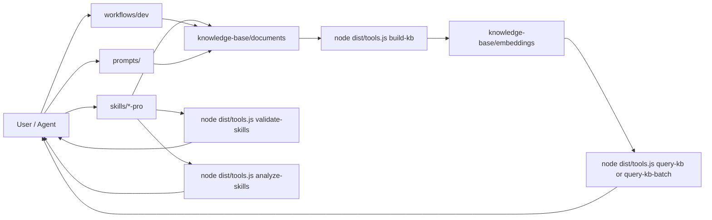

# SKILLS — Skills, workflows & knowledge base (Markdown)

Template repo: **`skills/`** (`SKILL.md` bundles), **`workflows/`** (Markdown steps), **`knowledge-base/`** (`.md` + local RAG). Config and workflow contracts use **Markdown**, not `.yaml`/`.yml` for those roles (scripts may emit JSON for embeddings).

## Contents

- [Directory layout](#directory-layout)
- [Quick start](#quick-start)
- [Knowledge base & RAG](#knowledge-base--rag)
- [Skills](#skills)
- [Workflows](#workflows)
- [Prompt templates](#prompt-templates)
- [Cursor / Agent](#cursor--agent)
- [More docs under `templates/`](#more-docs-under-templates)

## Directory layout

```
skills/                        # repo root (remote full install → .agents/devkit/)
├── config.example.md          # kb-config block for scripts
├── requirements.txt           # Legacy file (Python runtime no longer required)
├── skills/
│   ├── README.md
│   ├── examples/skill-template/SKILL.md
│   ├── <skill-name>/          # e.g. react-pro, nextjs-pro, …
│   └── …
├── workflows/
│   ├── README.md              # Conventions + naming (`w-<slug>.md`)
│   └── dev/                   # /w-ticket, /w-release, /w-hotfix
├── knowledge-base/
│   ├── INDEX.md
│   ├── documents/             # Source .md for RAG
│   └── embeddings/            # rag_*.npy, .json (generated, gitignored)
├── prompts/
│   ├── README.md
│   ├── planning/, review/, debugging/, generation/, analysis/, chains/
│   └── templates/example-skill-assisted-task.md
├── commands/                  # Single source for slash stubs (see commands/README.md)
├── package.json               # npx CLI (`devkit` / `own-skills`) + Node deps
├── src/                       # TypeScript source (CLI + tool commands)
│   ├── own-skills.ts
│   ├── tools.ts
│   └── ...
├── dist/                      # compiled runtime (used by npx bin)
│   ├── own-skills.js
│   └── tools.js
├── scripts/
│   ├── README.md
│   └── (documentation only; runtime commands are in `dist/tools.js`)
├── .cursor/commands/          # Symlinks → ../commands/ (dev ergonomics)
├── .claude/commands/          # Symlinks → ../commands/
└── templates/
```

## Architecture overview



## Quick start

### Install into another project (no manual clone)

From the **target project root**. Re-running install **updates** the bundle.

**Node 18+** — use the **`devkit`** / **`own-skills`** CLI (`npx` downloads this package, fetches the repo with degit or shallow git, then performs install/uninstall in Node). Requires **git** on `PATH`.

```bash
# Interactive (default command = install)
npx github:truongnat/skills

# Non-interactive full install (forward args after --)
npx --yes github:truongnat/skills -- install --yes --project-dir .

npx --yes github:truongnat/skills -- uninstall --force --yes
```

If `npx` does not pick the binary automatically: `npx --yes github:truongnat/skills devkit install --yes` (or `own-skills`).

**From a local clone**: `npm install && npm run build`, then `node dist/own-skills.js --help`.

**`npm error enoent … package.json`** when running `npx github:…/skills`: the **default branch on GitHub** must contain **`package.json`** at repo root (and `dist/own-skills.js` published by build output).

Bundle root: **`.agents/devkit/`** (single copy on disk; rules/commands/skills symlink from the bundle into `.cursor/`, `.claude/`, `.codex/`, `.agent/`). Legacy installs may still use **`vendor/own-skills/`** — `verify-bundle-install` accepts both. Flags: `--repo`, `--skills-only`, `--cursor-only` (see `node dist/own-skills.js --help`).

**Strict source-of-truth:** the installer overwrites managed command/rule symlinks from the bundle. After install, run **`verify-bundle-install --strict`** to warn if project-local commands/rules/skills are not symlinks into the bundle.

**Sanity check** (after a full install, not `--skills-only`):

```bash
node .agents/devkit/dist/tools.js verify-bundle-install --project-dir .
node .agents/devkit/dist/tools.js verify-bundle-install --project-dir . --strict
```

To run **`validate-skills`** inside verification, install bundle dependencies once: `cd .agents/devkit && npm ci` (the installer copies the tree without `node_modules`).

### Work in this repo (Node + TypeScript)

```bash
cd <repo-root>                 # e.g. folder `skills` after clone
npm install
npm run build
cp config.example.md config.md   # optional
node dist/tools.js build-kb
node dist/tools.js query-kb "…" -k 5
```

**CI:** Push/PR on `main` / `master` runs `npm ci`, `npm run build`, `validate-skills`, `build-kb`, and `verify-kb` — see [`.github/workflows/ci.yml`](.github/workflows/ci.yml).

See [`scripts/README.md`](scripts/README.md) for full command map.

## Knowledge base & RAG

1. Edit `.md` under [`knowledge-base/documents/`](knowledge-base/documents/).
2. Update [`knowledge-base/INDEX.md`](knowledge-base/INDEX.md) when you add a doc.
3. `node dist/tools.js build-kb` → `rag_embeddings.json` + `rag_manifest.json` in `knowledge-base/embeddings/` (gitignored).
4. Query: `node dist/tools.js query-kb "…"`; for many queries, `node dist/tools.js query-kb-batch` (multiple queries).
5. `node dist/tools.js verify-kb` after builds ([`knowledge-base/VERIFY.md`](knowledge-base/VERIFY.md)).

Model paths live in the `<!-- kb-config-start -->` … `<!-- kb-config-end -->` block in [`config.example.md`](config.example.md) or `config.md`.

**After changing bundled skills** (under `skills/*/`), run `node dist/tools.js build-skill-index` so `knowledge-base/embeddings/skill_index.json` stays current (used by `/route`, `/find-skill`, etc.).

## Skills

- **Rules:** [`skills/SKILL_AUTHORING_RULES.md`](skills/SKILL_AUTHORING_RULES.md) — do not add a skill folder until every mandatory item passes; **section 8** lists repo files to update with the same change.
- **Template:** [`skills/examples/skill-template/`](skills/examples/skill-template/) → `skills/<name>/`.
- **Catalog:** full list and descriptions in **[`skills/README.md`](skills/README.md)** (bundled examples table).

## Workflows

Conventions and **`w-<slug>.md`** naming: [`workflows/README.md`](workflows/README.md). Slash stubs live in **`commands/`** (symlinked under **`.cursor/commands/`** and **`.claude/commands/`** in this repo).

| Slash | File | Purpose |
|-------|------|---------|
| **`/w-ticket`** | [`workflows/dev/w-ticket.md`](workflows/dev/w-ticket.md) | Ticket / Kanban (`kanban/<ticket>/`, phased work) |
| **`/w-release`** | [`workflows/dev/w-release.md`](workflows/dev/w-release.md) | Release notes → implementation |
| **`/w-hotfix`** | [`workflows/dev/w-hotfix.md`](workflows/dev/w-hotfix.md) | Prod-urgent fix path |
| **`/w-code-review`** | [`workflows/dev/w-code-review.md`](workflows/dev/w-code-review.md) | Structured code review — severity-ranked feedback |
| **`/w-debug`** | [`workflows/dev/w-debug.md`](workflows/dev/w-debug.md) | Systematic debugging — reproduce → isolate → fix → verify |
| **`/w-security-audit`** | [`workflows/dev/w-security-audit.md`](workflows/dev/w-security-audit.md) | Security audit — threat surface + findings |
| **`/w-arch-review`** | [`workflows/dev/w-arch-review.md`](workflows/dev/w-arch-review.md) | Architecture / design review |
| **`/w-perf-investigation`** | [`workflows/dev/w-perf-investigation.md`](workflows/dev/w-perf-investigation.md) | Performance investigation |
| **`/w-refactor`** | [`workflows/dev/w-refactor.md`](workflows/dev/w-refactor.md) | Safe refactor — tests-first |
| **`/w-incident`** | [`workflows/dev/w-incident.md`](workflows/dev/w-incident.md) | Incident response — triage → mitigate → report |
| **`/w-data-migration`** | [`workflows/dev/w-data-migration.md`](workflows/dev/w-data-migration.md) | DB/data migration — plan, rollback, verification |
| **`/w-onboarding`** | [`workflows/dev/w-onboarding.md`](workflows/dev/w-onboarding.md) | Repo / team onboarding — map, conventions, first tasks |
| **`/w-api-design`** | [`workflows/dev/w-api-design.md`](workflows/dev/w-api-design.md) | API design review — contract, authz, errors |
| **`/w-test-strategy`** | [`workflows/dev/w-test-strategy.md`](workflows/dev/w-test-strategy.md) | Testing strategy — pyramid, risk, CI gates |
| **`/w-dep-audit`** | [`workflows/dev/w-dep-audit.md`](workflows/dev/w-dep-audit.md) | Dependency / supply-chain audit |

Index: [`workflows/dev/README.md`](workflows/dev/README.md) — Markdown step contracts; no automated runner required.

## Prompt templates

- Layout: [`prompts/README.md`](prompts/README.md) — planning, review, debugging, generation, analysis, chains.
- Monolith index: [`templates/PROMPT_TEMPLATES.md`](templates/PROMPT_TEMPLATES.md).
- Authoring: [`templates/prompt/prompt-template.md`](templates/prompt/prompt-template.md).

## Cursor / Agent

[`AGENTS.md`](AGENTS.md) — skills install paths, slash commands (`/route`, `/optimize`, …), KB usage.

## More docs under `templates/`

[`templates/START_HERE.md`](templates/START_HERE.md), [`templates/SKILL_SYSTEM_GUIDE.md`](templates/SKILL_SYSTEM_GUIDE.md), [`templates/config.template.md`](templates/config.template.md) — some sections are historical; **this README** and **`config.example.md`** are the source of truth for this repo.

## License

MIT (add a `LICENSE` file if you publish the repo).
