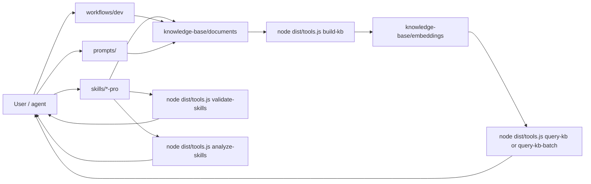

# SKILLS — Agent skills, workflows & knowledge (Markdown)

Reference layout: **`skills/`** (`SKILL.md` bundles), **`workflows/`** (step-by-step Markdown), **`knowledge-base/`** (`.md` + local RAG). Configuration and workflow conventions use **Markdown** (not `.yaml`/`.yml` for these roles; scripts may emit JSON for embeddings).

**Language:** Repository docs and bundled skills are **English**. For assistant replies in another language (e.g. Vietnamese), set **Cursor User Rules** or project rules — see [`AGENTS.md`](AGENTS.md) and [`skills/SKILL_AUTHORING_RULES.md`](skills/SKILL_AUTHORING_RULES.md) §13.

## Contents

- [Layout](#layout)
- [Quick start](#quick-start)
- [Knowledge base & RAG](#knowledge-base--rag)
- [Project indexing (any codebase)](#project-indexing-any-codebase)
- [Skills](#skills)
- [Workflows](#workflows)
- [Prompt templates](#prompt-templates)
- [Cursor / agent](#cursor--agent)

## Layout

Top-level structure:

```
.
├── skills/                    # Skill packs (e.g. react-pro, nestjs-pro, …)
├── scripts/                   # Tooling (entry: `dist/tools.js`)
├── templates/                 # Report, issue, and prompt templates
├── workflows/                 # Runnable procedures (Markdown steps)
└── knowledge-base/            # Internal KB and embeddings
```

Full tree (abridged):

```
.                              # Repo root
├── AGENTS.md                  # Hints for Cursor / agents (skills, commands, KB)
├── OUTPUT_CONVENTIONS.md      # Report formatting for workflows
├── LICENSE                    # MIT
├── package.json               # npx CLI and npm scripts
├── skills/
│   ├── README.md
│   ├── SKILL_AUTHORING_RULES.md
│   └── <skill-name>/          # e.g. react-pro, repo-tooling-pro, …
├── scripts/
│   └── README.md              # Command map
├── templates/
│   ├── README.md
│   └── report/                # e.g. project-index-report.md
├── workflows/
│   ├── README.md              # Conventions, parallel execution
│   └── dev/                   # /ticket, /index-project, …
├── knowledge-base/
│   ├── INDEX.md
│   ├── documents/             # RAG source .md
│   └── embeddings/            # rag_*.json, skill_index.json
├── prompts/                   # Planning, review, …
├── src/                       # TypeScript source
└── dist/                      # Compiled JS (`npm run build`)
```

## Architecture overview



## Quick start

### Install into another project

Run from the **target project root**.

```bash
# Install (default)
npx github:truongnat/skills

# Update an existing install
npx github:truongnat/skills update
```

### Work in this repo (Node + TypeScript)

```bash
npm install
npm run build
node dist/tools.js build-kb
node dist/tools.js query-kb "your question"
```

See [`scripts/README.md`](scripts/README.md) for the full command map.

## Knowledge base & RAG

1. Edit `.md` files under [`knowledge-base/documents/`](knowledge-base/documents/).
2. Update [`knowledge-base/INDEX.md`](knowledge-base/INDEX.md).
3. Run `node dist/tools.js build-kb`.
4. Query: `node dist/tools.js query-kb "..."`.

## Project indexing (any codebase)

Use when you need a vector index and Markdown summary for a **different** repository.

1. **CLI:** `node dist/tools.js index-project --dir <project_root> --out <index_dir>`.
2. **Query:** `node dist/tools.js query-kb "question" --index <index_dir>`.
3. **Wiki:** `node dist/tools.js generate-wiki --docs <index_dir>/docs`.
4. **Workflow:** **`/index-project`** ([`workflows/dev/index-project.md`](workflows/dev/index-project.md)).

## Skills

- **Rules:** [`skills/SKILL_AUTHORING_RULES.md`](skills/SKILL_AUTHORING_RULES.md).
- **Catalog:** Full list in **[`skills/README.md`](skills/README.md)**.

## Workflows

Naming and parallel execution: [`workflows/README.md`](workflows/README.md).

| Command | File | Purpose |
|---------|------|---------|
| **`/ticket`** | [`workflows/dev/ticket.md`](workflows/dev/ticket.md) | Ticket / Kanban |
| **`/release`** | [`workflows/dev/release.md`](workflows/dev/release.md) | Release notes → implementation |
| **`/hotfix`** | [`workflows/dev/hotfix.md`](workflows/dev/hotfix.md) | Urgent production fix |
| **`/code-review`** | [`workflows/dev/code-review.md`](workflows/dev/code-review.md) | Structured code review |
| **`/debug`** | [`workflows/dev/debug.md`](workflows/dev/debug.md) | Systematic debugging |
| **`/security-audit`** | [`workflows/dev/security-audit.md`](workflows/dev/security-audit.md) | Security review |
| **`/arch-review`** | [`workflows/dev/arch-review.md`](workflows/dev/arch-review.md) | Architecture / design review |
| **`/perf-investigation`** | [`workflows/dev/perf-investigation.md`](workflows/dev/perf-investigation.md) | Performance investigation |
| **`/refactor`** | [`workflows/dev/refactor.md`](workflows/dev/refactor.md) | Safe refactor (test-first) |
| **`/incident`** | [`workflows/dev/incident.md`](workflows/dev/incident.md) | Incident response |
| **`/data-migration`** | [`workflows/dev/data-migration.md`](workflows/dev/data-migration.md) | Data / DB migration |
| **`/onboarding`** | [`workflows/dev/onboarding.md`](workflows/dev/onboarding.md) | New member onboarding |
| **`/api-design`** | [`workflows/dev/api-design.md`](workflows/dev/api-design.md) | API design / review |
| **`/test-strategy`** | [`workflows/dev/test-strategy.md`](workflows/dev/test-strategy.md) | Test strategy |
| **`/dep-audit`** | [`workflows/dev/dep-audit.md`](workflows/dev/dep-audit.md) | Dependency audit |
| **`/index-project`** | [`workflows/dev/index-project.md`](workflows/dev/index-project.md) | Index any project |

## Prompt templates

See [`templates/README.md`](templates/README.md) and [`prompts/`](prompts/).

## Cursor / agent

See [`AGENTS.md`](AGENTS.md) for skills path, commands, KB usage, and **response language** configuration.

## License

[MIT](LICENSE)
