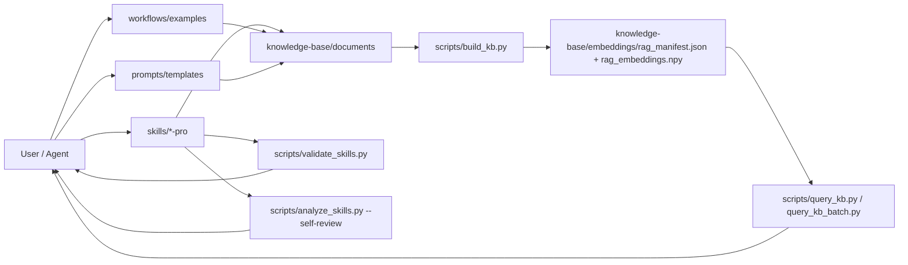

# SKILLS — Skills, workflows & knowledge base (Markdown)

Template repo for **skills** (per `SKILL.md` convention), **workflows** (Markdown step files), and a **knowledge base** (`.md` files + minimal local RAG). **Configuration and workflows do not use `.yaml`/`.yml`** — Markdown only (plus JSON emitted by scripts for the vector manifest).

## Contents

- [Directory layout](#directory-layout)
- [Quick start](#quick-start)
- [Knowledge base & RAG](#knowledge-base--rag)
- [Skills](#skills)
- [Workflows](#workflows)
- [Prompt templates](#prompt-templates)
- [Cursor / Agent](#cursor--agent)
- [More docs under `templates/`](#more-docs-under-templates)

## Directory layout

```
own-skills/
├── config.example.md          # Sample config (kb-config block for scripts)
├── requirements.txt           # Python: numpy, sentence-transformers
├── skills/
│   ├── README.md
│   ├── examples/skill-template/SKILL.md
│   ├── <skill-name>/           # e.g. react-pro, nextjs-pro, …
│   └── …
├── workflows/
│   ├── README.md              # Workflow convention (.md)
│   └── examples/*.md
├── knowledge-base/
│   ├── INDEX.md
│   ├── documents/             # Source-of-truth (.md)
│   └── embeddings/          # rag_*.npy / .json (generated, gitignored)
├── prompts/
│   └── README.md
├── scripts/
│   ├── README.md              # Script index (batch query, list/validate/analyze skills)
│   ├── kb_config_md.py        # Read config from Markdown
│   ├── build_kb.py
│   ├── query_kb.py
│   ├── query_kb_batch.py      # Multiple queries, one model load (perf)
│   ├── verify_kb.py
│   ├── list_skills.py
│   ├── validate_skills.py
│   └── analyze_skills.py      # Bundle heuristic + --self-review report
└── templates/                 # Extra docs & samples (see below)
```

## Architecture overview



## Quick start

```bash
cd own-skills
python3 -m venv .venv
source .venv/bin/activate   # Windows: .venv\Scripts\activate
pip install -r requirements.txt

# Config (optional): copy and edit the <!-- kb-config --> block
cp config.example.md config.md
nano config.md

# 🚀 REMOTE INSTALL (for external users - no need to clone this repo!)
# Install ALL skills from this repo into your project (1 command):
curl -fsSL https://raw.githubusercontent.com/truongnat/skills/main/install-remote.sh | bash
#  - downloads and installs all skills from https://github.com/truongnat/skills
#  - works from any directory in your project
#  - shows progress bars and status for each step
#  - no git clone required!

# Install from a different remote repository:
curl -fsSL https://raw.githubusercontent.com/truongnat/skills/main/install-remote.sh | bash -s -- --repo https://github.com/other/repo.git

# LOCAL INSTALL (if you have cloned this repo)
#* easiest: install ALL skills from default repo (https://github.com/truongnat/skills):
./install.sh
#  - installs all skills into current folder as the target project
#  - shows progress bars: [████████████] 75% (26/35) Installing: skill-name
#  - uses symlink mode and force replace by default

#* install specific skill from local repo:
./install.sh skills/git-operations-pro
#  - installs into current folder as the target project
#  - uses symlink mode and force replace by default

#* install from remote repository (no need to clone first):
./install.sh https://github.com/username/repo.git
#  - downloads directly from GitHub (no git clone needed!)
#  - works with GitHub shorthand: ./install.sh username/repo
#  - supports both individual skills and full skill repositories

#* install ALL skills from ANY remote repository:
./install.sh --remote https://github.com/username/repo.git
#  - downloads and installs all skills from the remote repo
#  - works with any GitHub repo containing a skills/ directory
#  - no need to clone the entire repo first

#* from a skill directory (if you are in skills/<name>):
python scripts/install_skill.py --project-dir /path/to/existing-project

#* explicit paths:
python scripts/install_skill.py --skill-dir skills/git-operations-pro --project-dir /path/to/existing-project --mode symlink

# Knowledge base — dry-run, build, query
python scripts/build_kb.py --dry-run
python scripts/build_kb.py
python scripts/query_kb.py "text to search" -k 5

# Multiple queries — one model load (faster than repeated query_kb.py)
python scripts/query_kb_batch.py -q "first question" -q "second question" -k 5

# Skill inventory / CI
python scripts/list_skills.py
python scripts/validate_skills.py

# Full bundle self-review (Markdown report)
python scripts/analyze_skills.py --self-review
```

**Python:** 3.10–3.13 recommended. First build downloads an embedding model (network, RAM). See [`scripts/README.md`](scripts/README.md) and skill **`repo-tooling-pro`** for script usage.

## Knowledge base & RAG

1. Add or edit `.md` files under [`knowledge-base/documents/`](knowledge-base/documents/).
2. Update [`knowledge-base/INDEX.md`](knowledge-base/INDEX.md) for quick lookup.
3. Run `scripts/build_kb.py` to produce `rag_embeddings.npy` + `rag_manifest.json` in `knowledge-base/embeddings/` (gitignored).
4. `scripts/query_kb.py` runs cosine similarity locally (NumPy); no Chroma/PyYAML required. For **many** queries, use **`scripts/query_kb_batch.py`** (loads the embedding model once).
5. After building, run `python scripts/verify_kb.py` to check config, file counts, and index consistency (see [`knowledge-base/VERIFY.md`](knowledge-base/VERIFY.md)).

Paths and model live in the `<!-- kb-config-start -->` … `<!-- kb-config-end -->` block in [`config.example.md`](config.example.md) or `config.md`.

## Skills

- **Authoring rules (mandatory for new skills):** [`skills/SKILL_AUTHORING_RULES.md`](skills/SKILL_AUTHORING_RULES.md) — do not add a skill folder until every mandatory item is satisfied. When you add/remove/rename a bundled skill or add a workflow/KB doc, follow **§8** (update `README`, `AGENTS`, `skills-layout.md`, `INDEX.md`, etc. in the same change).
- Copy [`skills/examples/skill-template/`](skills/examples/skill-template/) → `skills/<skill-name>/`.
- Edit `SKILL.md`: frontmatter `name` and `description` (state clearly when it triggers).
- Layout and bundled examples: [`skills/README.md`](skills/README.md).
- Bundled examples: [`skills/react-pro/`](skills/react-pro/) (React web), [`skills/nextjs-pro/`](skills/nextjs-pro/) (Next.js), [`skills/react-native-pro/`](skills/react-native-pro/) (React Native / Expo), [`skills/flutter-pro/`](skills/flutter-pro/) (Flutter), [`skills/javascript-pro/`](skills/javascript-pro/) (JavaScript architecture, tips/tricks, edge cases), [`skills/performance-tuning-pro/`](skills/performance-tuning-pro/) (performance tuning, profiling, bottlenecks, edge cases), [`skills/clean-code-architecture-pro/`](skills/clean-code-architecture-pro/) (clean code and clean architecture practices), [`skills/api-design-pro/`](skills/api-design-pro/) (API design, contract evolution, idempotency, edge cases), [`skills/graphql-pro/`](skills/graphql-pro/) (GraphQL schema design, resolvers, performance, security), [`skills/websocket-pro/`](skills/websocket-pro/) (WebSocket reliability, lifecycle, scaling, security), [`skills/microservices-pro/`](skills/microservices-pro/) (microservices boundaries, communication, resilience, operations), [`skills/stream-rtc-pro/`](skills/stream-rtc-pro/) (stream/RTC signaling, media QoS, scaling, security), [`skills/nestjs-pro/`](skills/nestjs-pro/) (NestJS), [`skills/postgresql-pro/`](skills/postgresql-pro/) (PostgreSQL), [`skills/sql-data-access-pro/`](skills/sql-data-access-pro/) (SQLite, SQL access), [`skills/testing-pro/`](skills/testing-pro/) (testing & automation), [`skills/security-pro/`](skills/security-pro/) (cross-platform security), [`skills/electron-pro/`](skills/electron-pro/) (Electron desktop), [`skills/tauri-pro/`](skills/tauri-pro/) (Tauri desktop), [`skills/deployment-pro/`](skills/deployment-pro/) (deployment & release), [`skills/seo-pro/`](skills/seo-pro/) (SEO & organic search), [`skills/design-system-pro/`](skills/design-system-pro/) (design system & UI/UX), [`skills/mobile-design-pro/`](skills/mobile-design-pro/) (mobile UX & patterns), [`skills/business-analysis-pro/`](skills/business-analysis-pro/) (business analysis & requirements), [`skills/content-analysis-pro/`](skills/content-analysis-pro/) (documents, images, video analysis), [`skills/data-analysis-pro/`](skills/data-analysis-pro/) (EDA, pandas, spreadsheets), [`skills/image-processing-pro/`](skills/image-processing-pro/) (Pillow, raster ops), [`skills/web-research-pro/`](skills/web-research-pro/) (sources, citations, stale docs), [`skills/market-research-pro/`](skills/market-research-pro/) (market sizing, competitors, positioning), [`skills/strategic-consulting-pro/`](skills/strategic-consulting-pro/) (strategy options, prioritization, scenarios), [`skills/code-packaging-pro/`](skills/code-packaging-pro/) (pyproject, Docker, GitHub Actions), [`skills/git-operations-pro/`](skills/git-operations-pro/) (Git, PRs, commits), [`skills/skills-self-review-pro/`](skills/skills-self-review-pro/) (skill bundle self-review, gap reports), [`skills/bug-discovery-pro/`](skills/bug-discovery-pro/) (bug hunting, GitNexus), [`skills/repo-tooling-pro/`](skills/repo-tooling-pro/) (scripts, KB batch query, validate skills).

## Workflows

- Convention: [`workflows/README.md`](workflows/README.md).
- Examples: [`workflows/examples/research-synthesize.md`](workflows/examples/research-synthesize.md), [`workflows/examples/implement-react-feature.md`](workflows/examples/implement-react-feature.md) (React + `react-pro`), [`workflows/examples/implement-nextjs-feature.md`](workflows/examples/implement-nextjs-feature.md) (Next.js + `nextjs-pro`), [`workflows/examples/implement-rn-screen.md`](workflows/examples/implement-rn-screen.md) (RN + `react-native-pro`), [`workflows/examples/implement-flutter-screen.md`](workflows/examples/implement-flutter-screen.md) (Flutter + `flutter-pro`), [`workflows/examples/implement-nest-feature.md`](workflows/examples/implement-nest-feature.md) (NestJS + `nestjs-pro`), [`workflows/examples/implement-postgres-change.md`](workflows/examples/implement-postgres-change.md) (Postgres + `postgresql-pro`), [`workflows/examples/implement-testing-suite.md`](workflows/examples/implement-testing-suite.md) (testing + `testing-pro`), [`workflows/examples/implement-security-review.md`](workflows/examples/implement-security-review.md) (security + `security-pro`), [`workflows/examples/implement-deployment-pipeline.md`](workflows/examples/implement-deployment-pipeline.md) (deployment + `deployment-pro`), [`workflows/examples/implement-seo-program.md`](workflows/examples/implement-seo-program.md) (SEO + `seo-pro`), [`workflows/examples/implement-design-system.md`](workflows/examples/implement-design-system.md) (design system + `design-system-pro`), [`workflows/examples/implement-mobile-design.md`](workflows/examples/implement-mobile-design.md) (mobile UX + `mobile-design-pro`), [`workflows/examples/implement-business-analysis.md`](workflows/examples/implement-business-analysis.md) (business analysis + `business-analysis-pro`), [`workflows/examples/implement-content-analysis.md`](workflows/examples/implement-content-analysis.md) (content analysis + `content-analysis-pro`), [`workflows/examples/implement-data-analysis.md`](workflows/examples/implement-data-analysis.md) (data analysis + `data-analysis-pro`), [`workflows/examples/implement-web-research.md`](workflows/examples/implement-web-research.md) (web research + `web-research-pro`), [`workflows/examples/implement-git-workflow.md`](workflows/examples/implement-git-workflow.md) (Git + `git-operations-pro`), [`workflows/examples/implement-skills-self-review.md`](workflows/examples/implement-skills-self-review.md) (bundle audit + `skills-self-review-pro`), [`workflows/examples/implement-bug-discovery.md`](workflows/examples/implement-bug-discovery.md) (bug discovery + `bug-discovery-pro`).
- A workflow is a **Markdown contract** for humans/agents to follow sequentially; an automated runner is optional.

## Prompt templates

- Where to put files: [`prompts/README.md`](prompts/README.md).
- Example library: [`templates/PROMPT_TEMPLATES.md`](templates/PROMPT_TEMPLATES.md) (format described in Markdown).

## Cursor / Agent

- See [`AGENTS.md`](AGENTS.md): how to use skills with Cursor (copy/symlink into Cursor’s skills folder).

## More docs under `templates/`

- [`templates/START_HERE.md`](templates/START_HERE.md), [`templates/SKILL_SYSTEM_GUIDE.md`](templates/SKILL_SYSTEM_GUIDE.md), [`templates/config.template.md`](templates/config.template.md) — some sections are historical; **this repo’s source of truth** is this README and `config.example.md`.

## License

MIT (add a `LICENSE` file if you publish the repo).
