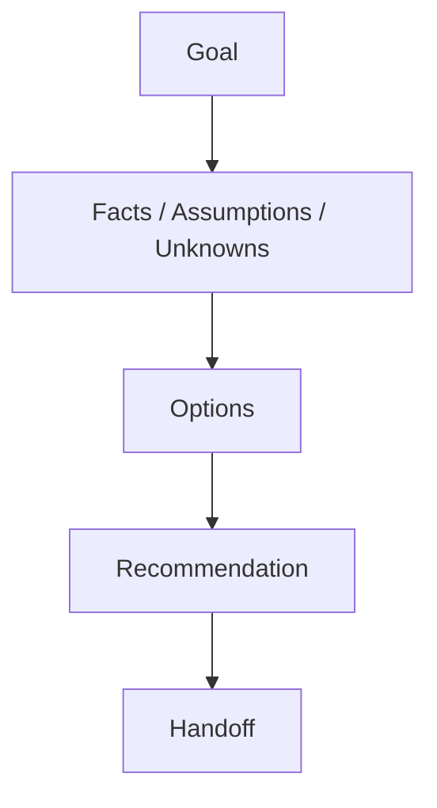

# Discussion

> Seeded by brainstorming step-01. Fill via steps 02–04. Do **not** invent PLAN/TASKS/design detail here.
> Separate **facts** vs **assumptions** vs **unknowns**. End with one clear **recommendation** + **handoff**.

## Executive summary (80/20)

<!-- Maximum five bullets: direction, key facts/unknowns, recommendation, top
risk, and next action. Fill this last, keep it first. -->

- _(TODO)_

## Developer overview

| Field | Value |
|---|---|
| Status | `needs_info` / `ready_to_recommend` / `recommended` |
| Open Critical/blocking | `0` |
| Visual decisions pending | `0` |
| Next action | _(ask user / fill options / handoff)_ |

## Charts (when useful)

<!-- Replace with a real options/risk chart when trade-offs exist. Use N/A if a
chart adds no decision value. -->

## Context (5W1H, when useful)

| What | Why | Who | When | Where | How |
|---|---|---|---|---|---|
| _(TODO/N/A)_ | _(TODO/N/A)_ | _(TODO/N/A)_ | _(TODO/N/A)_ | _(TODO/N/A)_ | _(TODO/N/A)_ |

## Goal

<!-- One sentence. -->

_(TODO)_

## Desired outcome

<!-- What success looks like. -->

_(TODO)_

## Confirmed facts

<!-- From user, repo, or research — not guesses. -->

- _(TODO)_

## Constraints

| Constraint | Source |
|------------|--------|
| _(TODO — time / stack / tools / policy)_ | _(user / repo)_ |

## Assumptions

| Assumption | Risk | Confirmed |
|------------|------|-----------|
| _(TODO)_ | Low / Medium / High | No |

## Unknowns

| Unknown | Blocking? | Owner |
|---------|-----------|-------|
| _(TODO)_ | Yes / No | _(if known)_ |

## Issue triage

<!-- Severity: Critical/High/Medium/Low. Clarity: Clear/Partial/Unknown.
Blocking=Yes means recommendation/planning must stop until answered. -->

| ID | Issue / decision | Severity | Clarity | Blocking? | Owner | Status |
|---|---|---|---|---|---|---|
| ISS-001 | _(TODO)_ | Critical / High / Medium / Low | Clear / Partial / Unknown | Yes / No | _(TODO)_ | Open / Answered |

## Clarification checkpoint

| Issue ID | Focused question | Why it blocks | User answer / evidence | Resolved? |
|---|---|---|---|---|
| ISS-001 | _(TODO)_ | _(TODO)_ | _(wait for answer)_ | Yes / No |

> **STOP gate:** Do not continue to Scope/Options while any Critical issue or
> blocking unknown is unresolved.

## Visual triage

| Issue ID | Visual need | Recommended format | Why this format helps | User confirmed? | Artifact/status |
|---|---|---|---|---|---|
| ISS-001 | none / useful / required | text / table / diagram / html-recommended | _(TODO)_ | Yes / No / N/A | _(path or not needed)_ |

## Scope in

- _(TODO)_

## Scope out

- _(TODO)_

## Non-goals

- _(TODO or none)_

## Options considered

| Option | Pros | Cons | Effort | Risk | Reversible? | How to verify |
|--------|------|------|--------|------|-------------|---------------|
| A — _(name)_ | | | | | | |
| B — _(name)_ | | | | | | |

<!-- At least one option. Prefer 2+ when trade-offs exist. -->

## Recommendation

- **Choose:** _(Option X)_
- **Reason:** _(why)_
- **Not choosing:** _(brief)_
- **Confidence:** High / Medium / Low

## Risks

| Risk | Impact | Mitigation |
|------|--------|------------|
| _(TODO)_ | _(TODO)_ | _(TODO)_ |

## Handoff

<!-- Next skill ≠ ready to code. If Unknowns still block implement, list them under Blockers. -->

- **Next skill:** business-analysis / basic-design / planning / research / execution _(pick one)_
- **Why:** _(one line)_
- **Blockers before next skill:** _(none or list — do not leave empty while blocking unknowns remain)_
