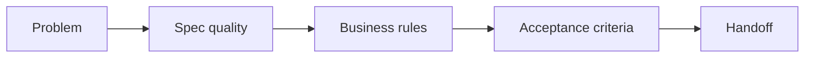

# Business Analysis

> Seeded by business-analysis step-01. Fill via steps 02–04.
> Do **not** treat specs as automatically correct or complete.
> Separate confirmed requirements from assumptions and open questions.

## Step ledger (mandatory — update every step)

| Step | Name | Status | Evidence |
|---|---|---|---|
| 01 | Init template | `todo` / `done` | path to this file |
| 02 | Frame + Spec quality | `todo` / `done` / `blocked` | Feasibility/Correctness/Capability filled |
| 03 | Stories / rules / AC | `todo` / `done` / `blocked` | BR/AC IDs present |
| 04 | Self-check | `todo` / `done` / `blocked` | checklist passed |

> **Hard rule:** Do not mark a later step `done` while an earlier step is still
> `todo`/`blocked`. Do not write stories/AC before Spec quality review is done.

## Executive summary (80/20)

<!-- Maximum five bullets: problem, key rule/decision, top Spec quality finding,
top risk, next action. Fill last, keep first. -->

- _(TODO)_

## Developer overview

| Field | Value |
|---|---|
| Status | `needs_info` / `ready_for_design` / `blocked` |
| Spec quality | Feasibility=`_` · Correctness=`_` · Capability gaps open=`0` |
| Open blocking questions | `0` |
| Next action | _(ask user / handoff)_ |

## Charts (when useful)

## Context (5W1H, when useful)

| What | Why | Who | When | Where | How |
|---|---|---|---|---|---|
| _(TODO/N/A)_ | _(TODO/N/A)_ | _(TODO/N/A)_ | _(TODO/N/A)_ | _(TODO/N/A)_ | _(TODO/N/A)_ |

## Problem statement

<!-- One sentence. -->

_(TODO)_

## Stakeholders

| Actor | Goal | Pain point | Authority |
|---|---|---|---|
| _(TODO)_ | _(TODO)_ | _(TODO)_ | _(TODO)_ |

## Scope

### In scope

- _(TODO)_

### Out of scope

- _(TODO)_

### Non-goals

- _(TODO or none)_

## Spec quality review

<!-- Mandatory BEFORE stories/rules/AC. Challenge the request/specs. -->

### 1. Feasibility (tính khả thi)

| Finding | Evidence | Verdict |
|---|---|---|
| _(TODO)_ | _(process / systems / data / timeline)_ | Pass / Pass-with-gaps / Fail / Unknown |

### 2. Correctness (tính đúng đắn)

| Finding | Evidence | Verdict |
|---|---|---|
| _(TODO)_ | _(current process / system / sample data)_ | Pass / Pass-with-gaps / Fail / Unknown |

### 3. Capability recommendations (khả năng feature / gaps)

| Gap ID | Missing / weak capability | Why it matters | Suggested question / default | Blocking? | Status |
|---|---|---|---|---|---|
| CAP-001 | _(TODO — e.g. max upload size)_ | _(TODO)_ | _(ask / propose)_ | Yes / No | Open / Deferred / Resolved |

> **STOP gate:** If Feasibility/Correctness is `Fail`/`Unknown` with Blocking, or
> any CAP row is Blocking=Yes and Open, stop and ask before writing stories/AC.

## Open questions

| ID | Question | Owner | Blocking? | Status |
|---|---|---|---|---|
| Q-001 | _(TODO)_ | _(TODO)_ | Yes / No | Open / Answered |

## User stories / use cases

| ID | Actor | Need | Value |
|---|---|---|---|
| US-001 | _(TODO)_ | _(TODO)_ | _(TODO)_ |

## Business rules

| ID | Rule | Source | Confidence |
|---|---|---|---|
| BR-001 | _(TODO)_ | _(stakeholder / doc / observed)_ | High / Medium / Low |

## Data assumptions

| Assumption | Risk | Confirmation owner |
|---|---|---|
| _(TODO or none)_ | Low / Medium / High | _(TODO)_ |

## Acceptance criteria

| ID | Given / When / Then | Maps to |
|---|---|---|
| AC-001 | Given … when … then … | BR-001 / US-001 |

## Handoff

- **Next skill:** basic-design / planning / research / brainstorming _(pick one)_
- **Why:** _(one line)_
- **Ready?** No / Yes
- **Blockers:** _(none or list — include open Spec quality Blocking items)_
