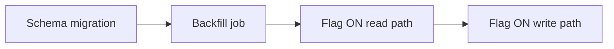

# Planning — tips and tricks

## Milestone naming

- Prefer **outcomes** over activities: “Auth service live in staging” beats “Work on auth module.”
- Include a **verifiable signal**: demo URL, metric threshold, or signed-off checklist row.

## Time-box discovery

- Discovery spikes need **exit criteria**: e.g. “By Friday: ADR draft + 2 prototype paths costed; else escalate to architecture review.”

## External dependencies

- Log **owner**, **ask**, and **due** in one place:

| Dependency | Owner | Need by | Status |
|------------|-------|---------|--------|
| API key for vendor X | Platform team | M2 | Waiting |

## Single source of truth

- One board or doc for status; **avoid** duplicating the same milestone in Slack + email + Jira without a canonical link.

## Checkpoint discipline

- Re-plan at **milestones**, not on every task slip — otherwise thrash.

## Example — phased work breakdown (markdown)

Use a consistent hierarchy so agents and humans can scan:

```markdown
## Goal
Replace in-process session store with Redis; zero user-visible downtime.

## Phases
1. **P0 — Add Redis adapter behind feature flag** (Week 1–2)
   - Done: flag off in prod; read path dual-read validated in staging.
2. **P1 — Cutover writes** (Week 3)
   - Done: 100% writes to Redis; rollback = flip flag + drain old store.
3. **P2 — Remove legacy** (Week 4)
   - Done: code removed; load test passed; runbook updated.

## Critical path
P0 → Redis cluster provisioned → P1 → P2
```

## Example — dependency snippet (mermaid)



(Use plain bullet lists if Mermaid is unavailable; the **order** matters more than the diagram.)

## Example — risk register (minimal)

| Risk | Likelihood | Impact | Mitigation | Trigger to escalate |
|------|------------|--------|------------|---------------------|
| Vendor API rate limit | M | H | Cache + backoff | 429 > 1% requests |

## Cross-links

- Deeper: [scope-and-decomposition.md](scope-and-decomposition.md), [sequencing-and-dependencies.md](sequencing-and-dependencies.md), [estimation-and-risk-controls.md](estimation-and-risk-controls.md).
