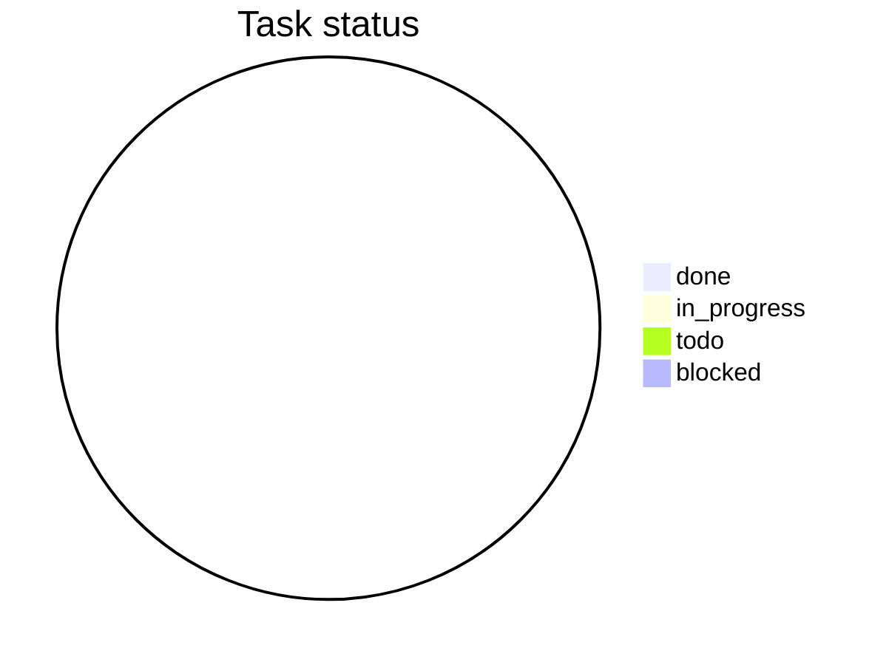
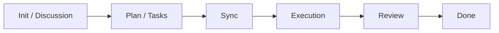

# Session overview

> Developer landing page. Keep this scannable. Refresh after sync, execution,
> review, and done. Detail lives in sibling artifacts; this file is the map.

## At a glance (80/20)

| Field | Value |
|---|---|
| Status | `todo` / `in_progress` / `blocked` / `needs_info` / `done` |
| Goal | _(one sentence)_ |
| Progress | `0/N` cards done · `0` blocked · `0` needs info |
| Top risk / blocker | _(or none)_ |
| Next action | _(skill + concrete command/question)_ |
| Owner | _(if known)_ |

## Progress chart

<!-- Do NOT hand-edit these numbers. Regenerate from real card states with
`bash .agents/tools/session/session.sh status` and paste its pie + counts here.
Status stays `done` only when that tool prints COMPLETE: yes and review passed. -->

## Open decisions

| ID | Severity | Blocking? | Visual? | Question / decision | Status |
|---|---|---|---|---|---|
| _(none or ISS-001)_ | | | | | |

## Artifact map

| Artifact | Purpose | Freshness |
|---|---|---|
| `DISCUSSION.md` | Direction / options | missing / current / stale |
| `BUSINESS_ANALYSIS.md` | Requirements | missing / current / stale |
| `BASIC_DESIGN.md` / `DETAIL_DESIGN.md` | Design | missing / current / stale |
| `PLAN.md` / `TASKS.md` | Strategy + work | missing / current / stale |
| `SYNC.md` | Readiness | missing / current / stale |
| `EXECUTION.md` | Implementation log | missing / current / stale |
| `REVIEW.md` / `REVIEW_PR.md` | Quality gate | missing / current / stale |
| `TESTCASES.md` | Verification design | missing / current / stale |
| `DONE.md` | Handoff | missing / current / stale |

## Developer notes

- Commands to run next:
- Files/paths to inspect first:
- What not to touch:
