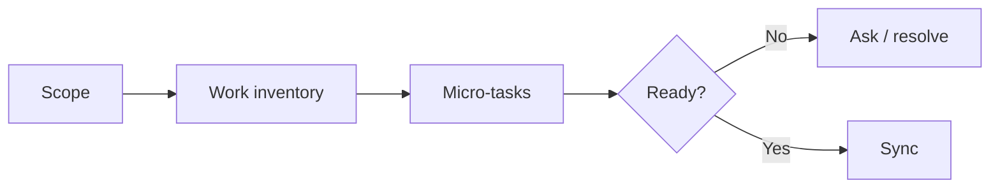

# Plan

> Filled by planning step-02. Strategy only — **no** full task cards (`### T-00x` with AC/Verify/Files) in this file.
> Session path: replace placeholders. See `TASKS.md` for executable work.

## Executive summary (80/20)

<!-- Maximum five bullets: goal, approach, top risk, readiness, and next
action. Fill this last, keep it first. -->

- _(TODO)_

## Developer overview

| Field | Value |
|---|---|
| Status | `needs_info` / `planning` / `ready_for_sync` / `blocked` |
| Cards drafted | `0` |
| Critical open decisions | `0` |
| Next action | _(ask user / fill tasks / sync)_ |

## Charts (when useful)

<!-- Add a progress/risk Mermaid chart when the task set is large. -->

## Context (5W1H, when useful)

| What | Why | Who | When | Where | How |
|---|---|---|---|---|---|
| _(TODO/N/A)_ | _(TODO/N/A)_ | _(TODO/N/A)_ | _(TODO/N/A)_ | _(TODO/N/A)_ | _(TODO/N/A)_ |

## Pre-planning decision gate

<!-- Inherit unresolved items from DISCUSSION/BA/design. Also add issues found
during planning. Do not fill strategy/tasks while a blocking row is open. -->

| Issue ID/source | Issue / decision | Severity | Clarity | Blocking? | Visual need/format | Resolution evidence | Status |
|---|---|---|---|---|---|---|---|
| _(TODO)_ | _(TODO)_ | Critical / High / Medium / Low | Clear / Partial / Unknown | Yes / No | none / text / table / diagram / html-recommended | _(user answer/path)_ | Open / Resolved |

### Questions requiring user input

| Issue | Focused question | Why the plan changes | Answer |
|---|---|---|---|
| _(TODO)_ | _(TODO)_ | _(TODO)_ | _(wait for user)_ |

> **STOP gate:** Strategy and TASKS stay unfilled while any Critical issue,
> blocking unknown, or unconfirmed `html-recommended` item is open.

## Goal

<!-- One sentence. -->

_(TODO)_

## Scope

- _(TODO)_

## Non-goals

- _(TODO)_

## Assumptions

| Assumption | Risk | Confirmed |
|------------|------|-----------|
| _(TODO)_ | Low / Medium / High | No / Yes |

## Approach

<!-- Phased strategy only — not per-task AC/Verify/Files. -->

1. _(TODO — phase)_
2. _(TODO — phase)_
3. _(TODO — phase: implement feature before automated tests)_

## Affected areas

| Area / path | Expected change | Confidence |
|-------------|-----------------|------------|
| _(TODO)_ | _(TODO)_ | known / inferred / unknown |

## Test strategy

<!-- Optional. How to verify **after** code exists. Not write-tests-first. -->

- _(TODO or N/A)_

## Verification strategy

- _(TODO — automated)_
- _(TODO — manual)_

## Definition of done

- [ ] _(TODO)_
- [ ] `TASKS.md` complete and matches Task index below

## Rollback strategy

- **Code:** _(TODO)_
- **Config:** _(TODO)_
- **Data:** _(TODO or N/A)_

## Risks

| Risk | Impact | Mitigation |
|------|--------|------------|
| _(TODO)_ | _(TODO)_ | _(TODO)_ |

## Task index

<!-- Draft OK in step-02. Step-03 replaces with fine-grained IDs from Work inventory. ID + short title only. -->

T-001 _(title)_ → T-002 _(title)_ → … → T-00N _(tests after code)_ (see TASKS.md)

## Handoff

<!-- Ready=Yes ONLY if blockers is "none" (or all resolved with evidence). Never Yes + open blockers. -->

- Ready for sync/execution? **No**
- Blockers: _(list unresolved items, or `none`)_
